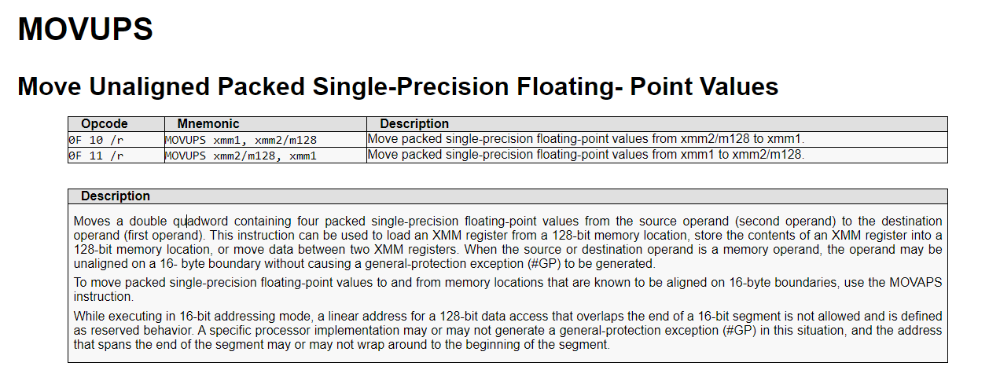

## floating points in assembly

we have 16 `%xmmi` registers (from `%xmm0` to `%xmm15`)

> [!NOTE]
> all `%xmmi` registers are caller-saved, which means that a function can modify them, and a caller ahve to save it on a stack

> [!NOTE]
> pamięć w rejstrach z pamieci jest odwracana tak zeby była logiczna!

each register has 16 bytes

we can use register as a vector of floats or as a one big float

### addition
`addss` add **s**calar **s**ingle precision
`addps` add **p**ararel **s**ingle precision
we have allso **double** prevcsionson

`movapd` -  Move Aligned Packed Double Precision Floating-Point Values

`movups` - moves unaligned packet signle precision (but four of them so moves double quadword)

`movdqa` - moves aligned double quadword