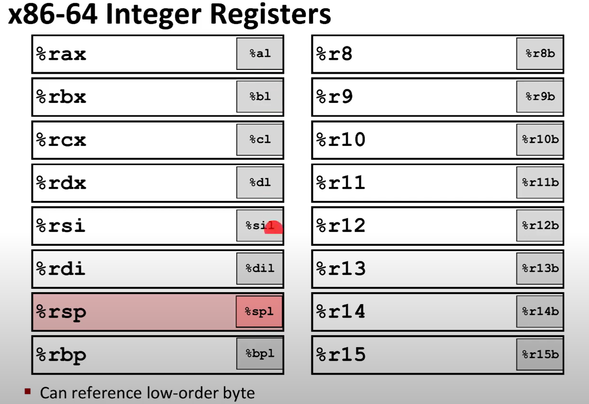

# jumps - if, switch, loops

### condition codes

`%rip` instruction pointer register

`CF` - carry flag (for unsiged)\
`OF` - overflow flag (for siged)\
`ZF` - zero flag\
`SF` - Sign flag (for signed)\
<!-- `AF` - aux carry flag\ -->
<!-- `PF` - parity flag\ -->

`cmpq a,b` -------> b-a

`testq b,a` --------> b&a 

very often we can see
`testq %rax, %rax`


`setX dest` set low-order byte of dest to 0 or 1 bsed on combination of condition codes

> [!WARNING]
> what about little endiness of operating systems?
> 
>


> [!WARNING]
> be carefull when writing to 4 byte register `l`
> because it will zero high-order (right) part of register
> 
> 


`movzbl %al, %rax` - clears right part of register

example:

    cmpq %rsi, %rdi
    setg %al
    movzbl %al, %eax
    ret

### jumps

`jX` instruction: 

* `jmp` - unconditional jump

* `je` - zero / equal

* `jne` - not eq, not zero

* `js` - negative (signed) flag

* `jg(e)` - greater

* `jl(e)` - less
* `ja` - is greater but in unsigned
* `jb` - is below but in unsigned

> [!NOTE]
> gcc flags:\
> `-Og` - readible, but debuggable optimalization\
> `-S` - prints human readble assembly code\
> `-fno-if-conversion` to disallow some optimalizations


`cmovele` - condition move - move if less or equal

### loops
during compilation from C to assembly - compiler changes for loops to while, do while loops, if while loops, but in if while loops he can obsersve that the first if always true and delete it during optimalization

> [!NOTE]
> `jmp *0x402680(,%rax,8)` indirect
>
> `jmp foo` direct

`cqto` extends %rax to rdx:rax (signed) 

>[!NOTE]
>there exists something called indirect jumps:\
>every indirect jump has to have an asterix (**\***) before jump address
>
>* `jmp %rax` - doesn't work
>* `jmp *%rax` - work
>
> ass msg:\
> 
>
>###  example of indirect jump
>
>```
>int foo(void (*f)(void))
>{
>    f();
>}
>```

