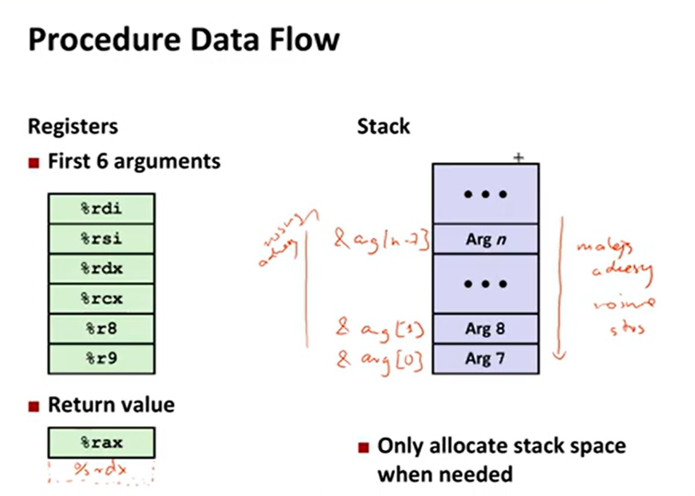
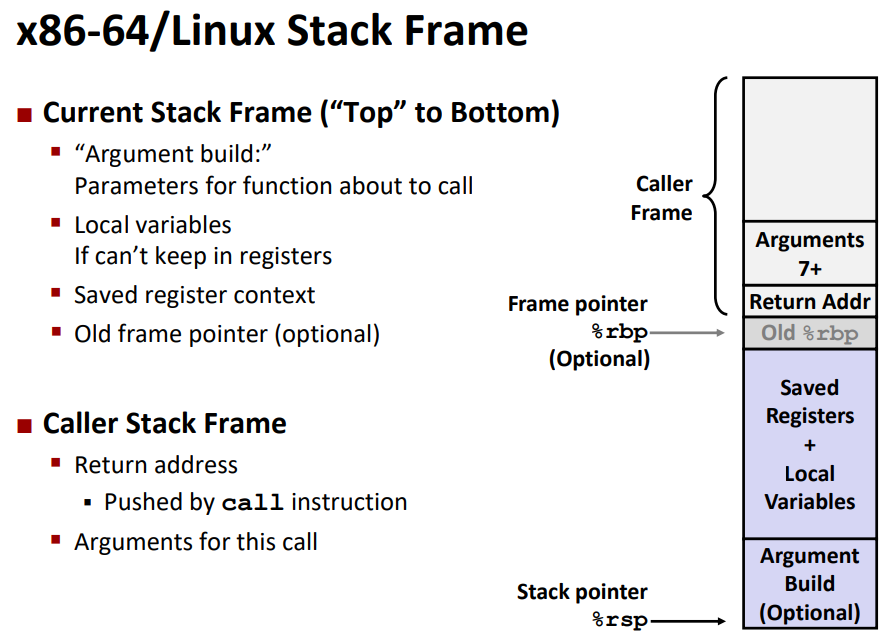
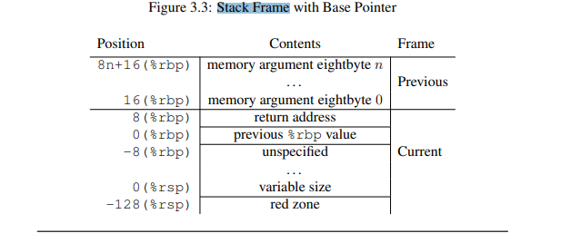
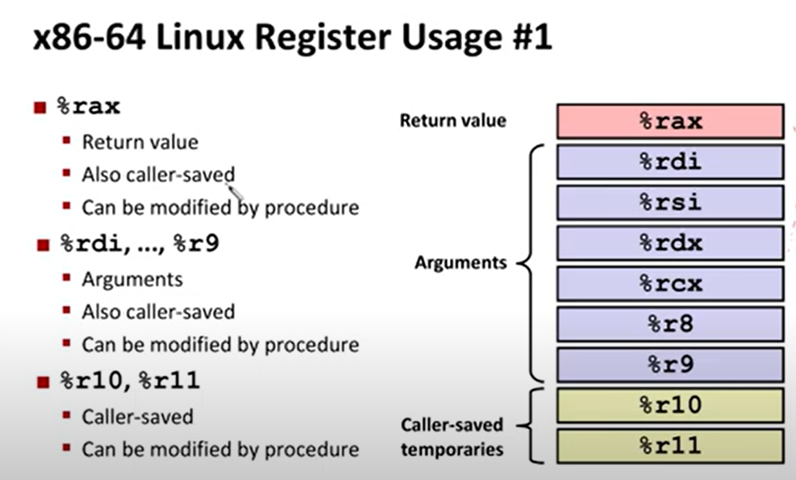
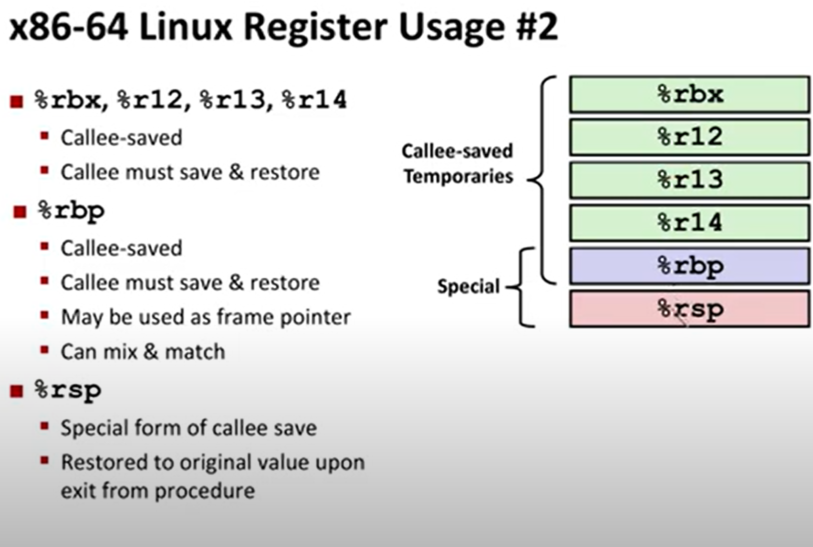

# stack

> [!NOTE]
> `method` vs `function` vs `procedure`
>
> * `method` is a function or procedure that can be applied over instance of some class `array.sort()`
> * `function` has to return sth
> * `procedure` doesn't return antyhing
>
> e.g.\
> the result of a function call can be assigned to some variable. `let a = foo()` 

> [!NOTE]
> tail recursion is equivalent loops

<!-- rekord aktywacji procedury -->

`%rbp` - `początek rekordu aktywacji procedury/ stack frame` 

callq addr:
* pushuje na stos adress następnej instukcji (występującej po `callq` w kodzie), pushuje rbp poprzedniej ramki
* skacze w miejsce addr

> [!NOTE]
> aby móc pamiętać `%rbp` swojej oraz poprzedniej ramki - powiniśmy ją zapisać poprzednie `%rbp` na stosie. Jest za to odpowiedzialny `callee`. Wtedy wracając z funckji zostanie wykonana sekwencja:\
> `movq %rbp, %rsp`\
> `movq %rbp`\
> `retq`
>
> co jest równoważne:\
> `leave; retq;`

retq:
* zdejmuje ze stosu addres następnej instucki po callq
* skacze w to miejsce
* w szczególności mógłby być to problem ponieważ wieszkni element stosu mógłby nie być kodem powrotu
* popuje poprzedni `rbp` i wrzuca go do `rsp`

### stack frame

`%rbp` referneces to `previous stackframe %rbp`

> [!NOTE]
> `leave` instruction:\
> Set `%rsp` to `%rbp`, then pop top of stack into `%rbp`

> [!NOTE]
> po zakończeniu procedury i zdjęcia najnoweszego rekordu atywacji procedury ze stosu. Pamięć użytkowana nie zostanie wyczyszczona. A zatem podczas deklarowania np tablicy intów (bez inicjalizacji) okazuje się że tablica ta bedzie miała wartości jakie miała ramka stosu

> [!WARNING]
> czy popq ma argument? ma wyciąga ostatnią wartość ze stosu w miejsce arguemtnu
> np. `popq %rax` przerzuci elements stosu do `raxa`

## types of registers:
* caller saved: - registers that can be changed by a procedure
  * caller saves temporary values in its frame befre the call
* calle saved: - registers that cannot be changed by a procedere
  * saves temporary value in its frame before using
  * restores them before returning to caller

