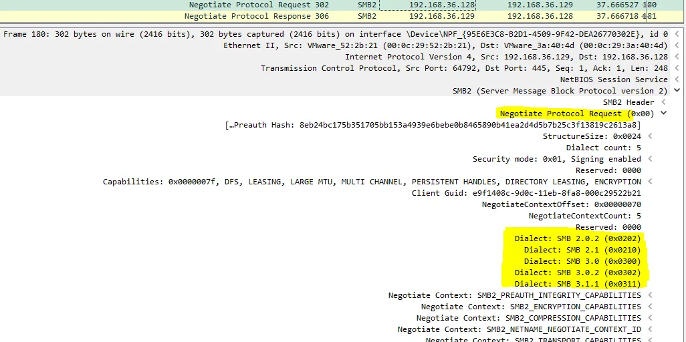
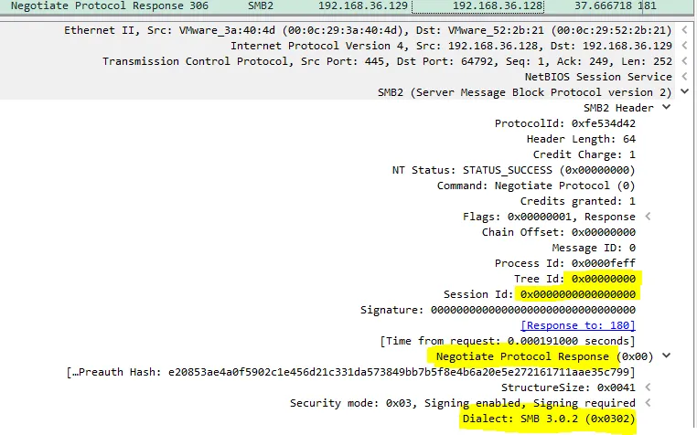
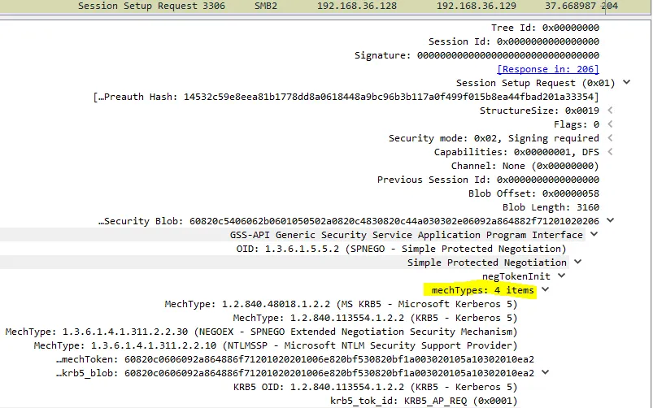
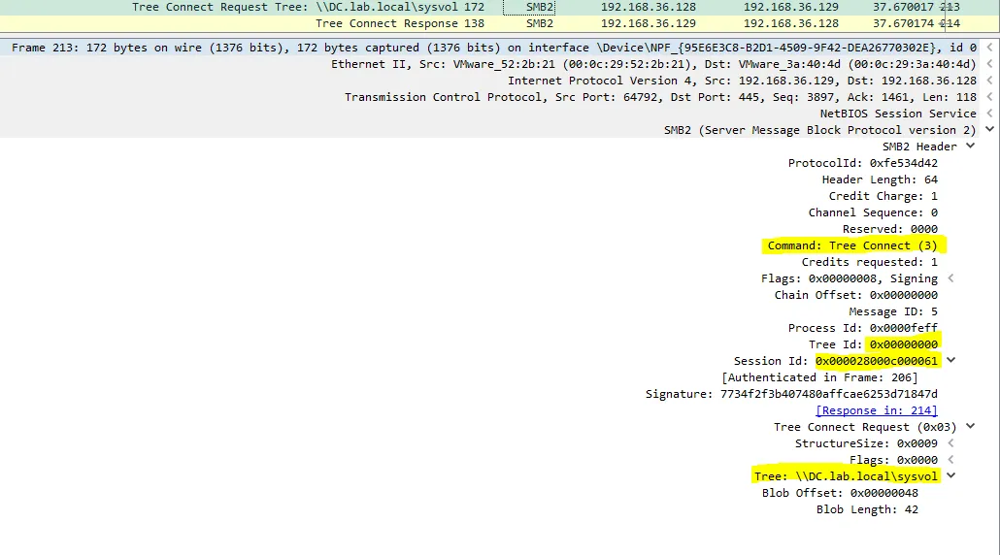
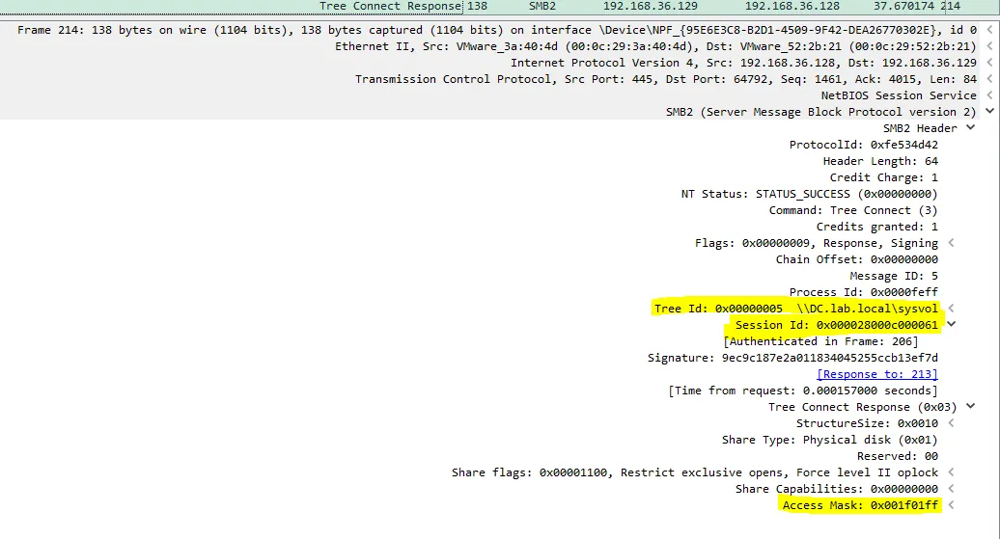
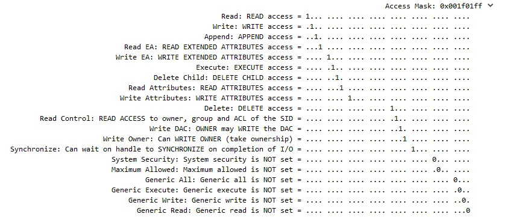
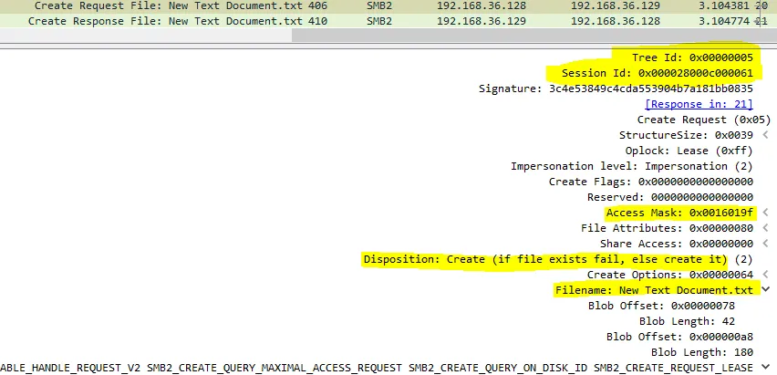

# SMB overview - how Active Directory utilizes SMB

[SMB-medium](https://amitschendel1.medium.com/smb-going-from-zero-to-hero-ff686e907e81)

* client-server protocol
* controlls access to shared files, directories and other resources in netowork(e.g. printers)
* read and write
* can be used on tcp/ip or other netowrk protocols
## Ports
* **Port 139** - the earlier versions of the SMB protocol primarily ran in small-scale LAN environments using the now outdated NetBIOS network architecture. SMB mainly used port 139 to allow communication between different machines on the network.
* **Port 445** - with the development of Windows 2000, Microsoft changed SMB to operate on top of TCP and use a dedicated IP port — port 445. This port is more secure because it supports encryption and digital signing of SMB packets. Port 139 doesn’t offer these security mechanisms and is more susceptible to eavesdropping and other attacks.

## Universal Naming Conventions - UNC

### windows: 
`\\<server name>\<share point>\<path to resource>`
    
* `<server name>` refers to the device that holds the resource.
* `<share point>` refers to the shared data area.
* `<path to resource>` is the logical directory where the requested information can be found, along with the name of the resource.

### linux:
`//<hostname>/<pathname>`

* `<hostname>` refers to the device that holds the resource.
* `<pathname>` refers to the logical directory where the resource can be found, along with the name of the resource. The <pathname> can be pre-fixed with <share point> when the resource is on a Microsoft platform.

during usage of `UNC` in windows console. windows find out that you wanna fetch that resource thorugh `smb`

## how Windows “detects” that it needs to use SMB.

MUP - `multiple UNC provider` is a kernel-mode component (a drvier mup.sys) responsible for channeling all remote file system access - using `UNC name` to `network redirector` that is capable of   the remote file system requests. 

## how communication looks like 

* **tcp session** - handshake
* **negotiate protocol** - both parts need to agree on SMB version
  * client - sends request with all smb version manned
    
  * server - chooses one of them
    sends also sessionId=0, treeId=0, because SMB session was not established yet
    
    > [!NOTE]
    You may be pondering about the Process Id field, well it’s not the process that started this connection. Microsoft may have planned it to be but in reality it will always be a random blob or a plain old 0.\
* **session setup** - client need to authenticate itself to the server
    > [!NOTE]
    > this is windows version of authentication, which is not part of SMB protocol

    > [!NOTE]
    > `LSA` - `The Local Security Authority Subsystem Service` (also called `LSASS`) is a **process** in Microsoft Windows that verifies logon attempts, password changes, creates access tokens, and other important tasks relating to Windows authentication and authorization protocols.
    >
    > `LSA` is used in both `computer domain` and in `workgroups`
  * during login to windows a `logon session` is created (and stored in `LSA`) - contains informations about:
    * group memberships 
    * kerberos tickets cache
    * etc
  * also `NT token` 
  * we can authoirze thorugh `Spengo` (`Simple Protected Negotiation`) which is a protocol wrapper which orchastrastes other protcols (e.g. kerberos)
  * req:
    
  * res (with session id):
    
* **Tree Connect** - we have to specify which share we want
  * by def it `$IPC`
  * req:
    
  * res:
  * 
    * `tree-id` from server side is mapped to our session
    * `access-mask` - tells about access rights
    
* **File operations**
  * 

WHAT is a sysvol
NETLOGON
User Shares 
ZZZ_archive