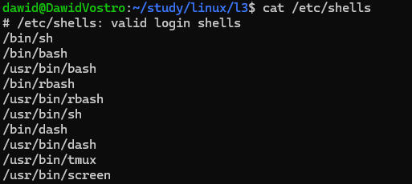

# links - linux escalation

* [blog gotmilk](https://blog.g0tmi1k.com/2011/08/basic-linux-privilege-escalation/)
* [payload all the things](https://github.com/swisskyrepo/PayloadsAllTheThings/blob/master/Methodology%20and%20Resources/Linux%20-%20Privilege%20Escalation.md)
* [total oscp guide](https://sushant747.gitbooks.io/total-oscp-guide/content/privilege_escalation_-_linux.html)
* [linux clipboard](https://book.hacktricks.xyz/linux-hardening/linux-privilege-escalation-checklist)

# it is all about enumeration
## initial enumeration - user
`cat /proc/version`
`lscpu`
`ps aux`
`cat /etc/hostname`
`sudo -l`
`id`
`cat /etc/passwd`
## network enumeration
`ip command`
`ip neight` - for arp table
`netstat -ano`

## password enumeration

`grep -rwn '/' -ie "PASSWORD" --color=always 2> /dev/null`
`locate pass`

`find / -name id_rsa 2> /dev/null`

`find / -name authorized_keys`

# tools

`linenum`

`linpeas`

`linux-exploit-suggester`

# local account

getting access through OS Credentials Dumping

techniques:

* looking for bash history file
* looking for passwd in etc files
* 

> [!NOTE]
> you can see all shell provided on a system in a file `/etc/shells`
> 

> [!NOTE]
> `gtfobins.github.io` - curated list of unix binarires that can be used to bypass\
> local security restrictions in misconfigured systems

`find . -type f -exec grep -i -I "PASSWORD" {} /dev/null \;`

# escalation via weak file permissions

look for `/etc/shadow`

# sudo 

`gtfobins` webpage

# escalation via Ld_PRELOAD

env_keep += LD_PRELOAD

